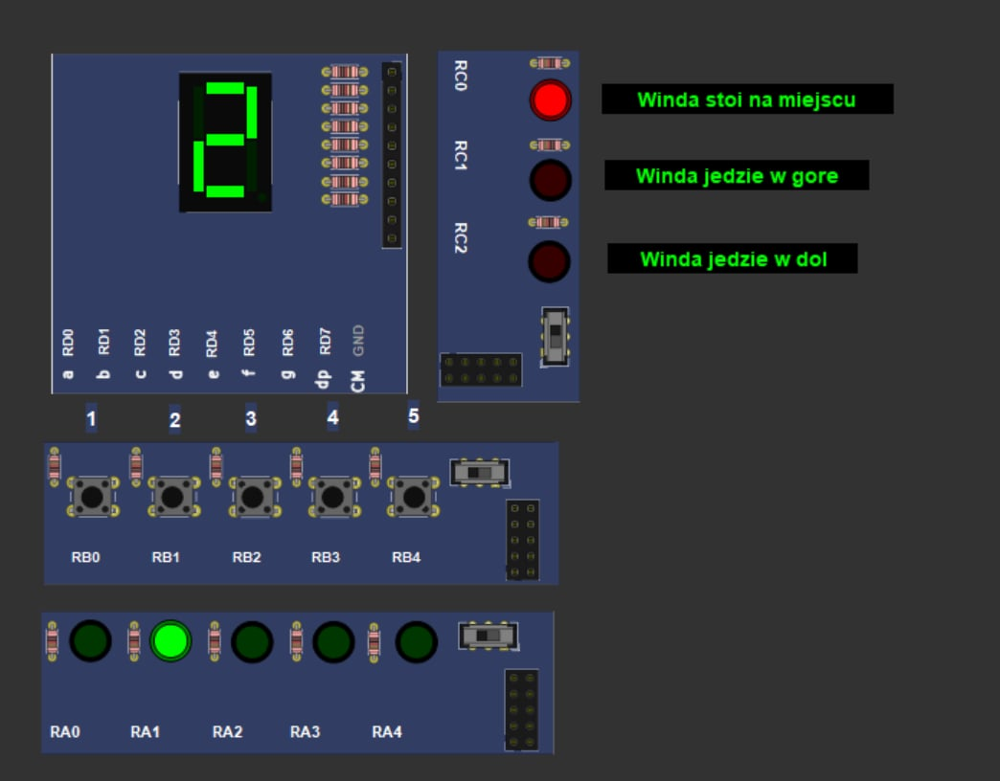

# Elevator Simulator — PIC16F877A

## Overview

This project is a simple elevator simulator developed for the PIC16F877A microcontroller using MPLAB X IDE and PICSimLab.

The system simulates:

* floor selection,
* elevator movement,
* floor indication,
* status LEDs,
* request processing.

The project was created for microcontroller programming and embedded systems practice.

---

# Technologies Used

## Hardware / Simulation

* PIC16F877A
* PICSimLab Breadboard Simulator

## Development Tools

* MPLAB X IDE
* XC8 Compiler
* MPASM Assembler

---

# Features

* 5-floor elevator simulation
* Push button floor selection
* 7-segment floor display
* Floor LEDs
* Elevator status LEDs
* Up / Down movement indication
* Request queue handling
* Basic SCAN elevator algorithm
* Button debouncing
* Real-time simulation in PICSimLab

---

# Project Structure

```text
ELEVATOR_SIMULATOR_PIC16F877A/
│
├── elevator.X/
│   ├── build/
│   ├── dist/
│   │   └── default/production/
│   │       ├── elevator.X.production.hex
│   │       ├── elevator.X.production.cof
│   │       └── elevator.X.production.map
│   │
│   ├── nbproject/
│   ├── main.asm
│   ├── newmain.c
│   └── Makefile
│
├── images/
│   └── 1.jpg
│
└── README.md
```

---

# Setup Instructions

## 1. Download Project

Clone repository:

```bash
git clone [link]
```

or download ZIP:

```text
Code → Download ZIP
```

Extract the project folder.

---

# Open Project in MPLAB X IDE

1. Open MPLAB X IDE
2. Click:

```text
File → Open Project
```

3. Select:

```text
elevator.X
```

4. Build project:

```text
Production → Clean and Build Main Project
```

5. HEX file will be generated automatically:

```text
elevator.X/dist/default/production/elevator.X.production.hex
```

---

# PICSimLab Configuration

## 1. Open PICSimLab

Select:

```text
Board → Breadboard
```

Microcontroller:

```text
PIC16F877A
```

---

# Load HEX File

```text
File → Load HEX
```

Select:

```text
elevator.X.production.hex
```

---

# Add Components in PICSimLab

## Push Buttons

Menu:

```text
Inputs → Push Buttons
```

Configuration:

| Button | PIC Pin |
| ------ | ------- |
| RB0    | Floor 1 |
| RB1    | Floor 2 |
| RB2    | Floor 3 |
| RB3    | Floor 4 |
| RB4    | Floor 5 |

Settings:

```text
Active → LOW
Mode → Normal
```

---

# 7-Segment Display

Menu:

```text
Outputs → 7 Segments Display
```

Configuration:

| Segment | PIC Pin |
| ------- | ------- |
| a       | RD0     |
| b       | RD1     |
| c       | RD2     |
| d       | RD3     |
| e       | RD4     |
| f       | RD5     |
| g       | RD6     |
| DP      | RD7     |

Settings:

```text
Type → Simple
Active → HIGH
```

---

# Floor LEDs

Menu:

```text
Outputs → LEDs
```

Configuration:

| LED | PIC Pin |
| --- | ------- |
| D1  | RA0     |
| D2  | RA1     |
| D3  | RA2     |
| D4  | RA3     |
| D5  | RA4     |

Settings:

```text
Active → HIGH
```

---

# Status LEDs

Add another LEDs component.

Configuration:

| LED | PIC Pin | Function      |
| --- | ------- | ------------- |
| D1  | RC0     | Elevator Idle |
| D2  | RC1     | Moving Up     |
| D3  | RC2     | Moving Down   |

Settings:

```text
Active → HIGH
```

---

# Running Simulation

Click:

```text
Run ▶
```

Test the simulator:

* Press RB0–RB4 buttons
* Observe:

  * current floor on display,
  * floor LEDs,
  * elevator movement LEDs.

---

# Working Principle

1. User presses a floor button.
2. Request is added to elevator queue.
3. Controller determines movement direction.
4. Elevator moves floor-by-floor.
5. Current floor is displayed on the 7-segment display.
6. LEDs indicate current elevator state.
7. Elevator stops at requested floor.

---

# Example PICSimLab Setup

## Simulation Screenshot

```markdown

```

---

# Educational Purpose

This project demonstrates:

* embedded systems programming,
* microcontroller I/O control,
* state machine implementation,
* digital electronics simulation,
* real-time control systems.

---

# Author Yauheniya Drozd

Microcontroller Programming Project
PIC16F877A + MPLAB X + PICSimLab